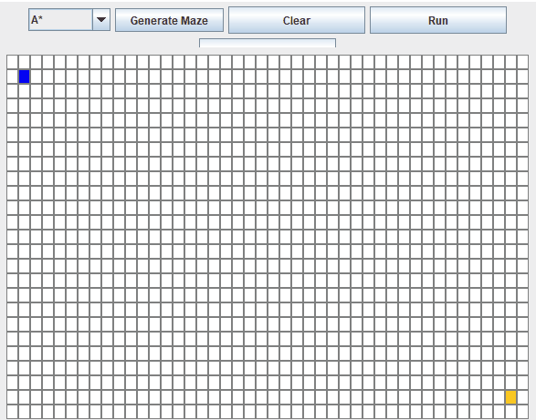

# Pathfinding Visualization Java Application

A Java-based application that visualizes pathfinding algorithms and provides an interactive experience for users to create and solve mazes. I created this app in order to better understand pathfinding. Users can draw mazes or have the program recursively generate a maze.

## Demonstration

Below is a small animation showing the application in action:



## Features

- **Pathfinding Algorithms:** Solve mazes using popular pathfinding algorithms such as AStar Depth-First Search (DFS) or Breadth-First Search (BFS).
- **Recursive Maze Generation:** Automatically generate mazes using recursive techniques, providing a unique puzzle each time.
- **Interactive Drawing:** Users can draw custom mazes using the mouse for personalized maze-solving challenges.
- **Animation of Solutions:** Visualize the maze-solving process with animations, enhancing the user experience.

## Tech Stack

- **Language:** Java (no external build tools used)
- **IDE:** Any Java-compatible IDE or text editor
- **Graphics:** Java AWT/Swing for GUI rendering and user interactions

## Installation and Setup

Follow these steps to compile and run the application locally:

### Prerequisites

- [Java Development Kit (JDK)](https://www.oracle.com/java/technologies/javase-downloads.html) installed on your system.
- A code editor or IDE such as [IntelliJ IDEA](https://www.jetbrains.com/idea/), [Eclipse](https://www.eclipse.org/downloads/), or a simple text editor.

### Step 1: Clone the Repository

1. Open your terminal.
2. Run the following command:
   ```bash
   git clone https://github.com/anthonynuge/pathfinding_visualization.git
   ```
3. Navigate to the project directory:
   ```bash
   cd pathfinding_visualization
   ```

### Step 2: Compile the Code

1. Navigate to the `src` directory:
   ```bash
   cd src
   ```
2. Compile the Java files using the `javac` command:
   ```bash
   javac *.java
   ```

### Step 3: Run the Application

1. Run the compiled Java application:
   ```bash
   java Main
   ```

The application will now be running, and you can begin interacting with the GUI to draw and solve mazes.

## Usage

- **Draw Maze:** Use your mouse to click and drag, creating walls for your custom maze.
- **Generate Maze:** Click the "Generate Maze" button to create a maze using a recursive algorithm.
- **Solve Maze:** Click the "Solve" button to visualize the pathfinding solution as it navigates through the maze.
